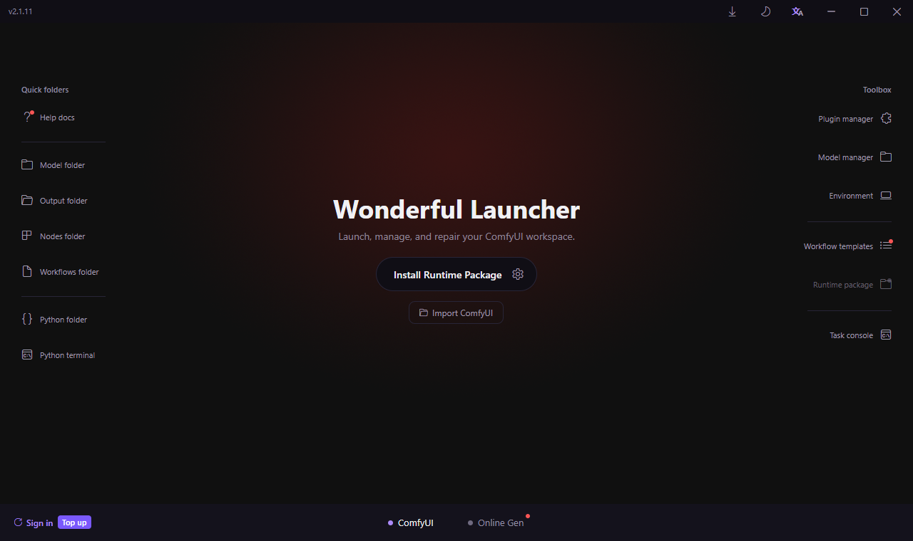
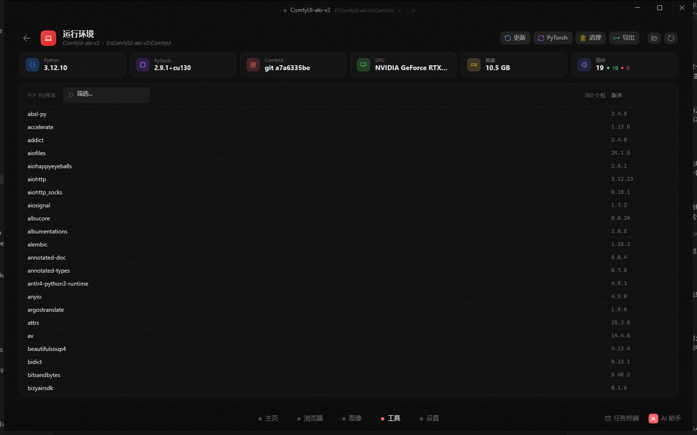
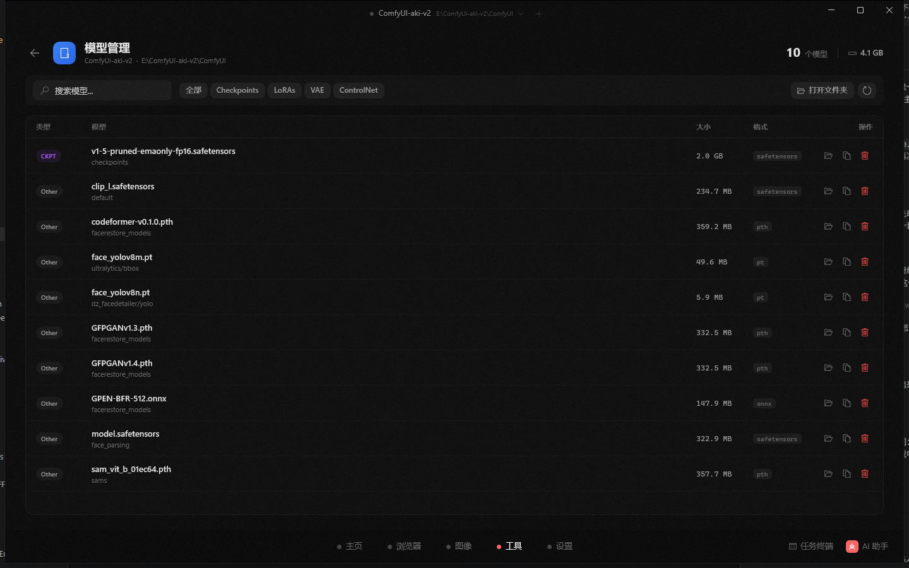
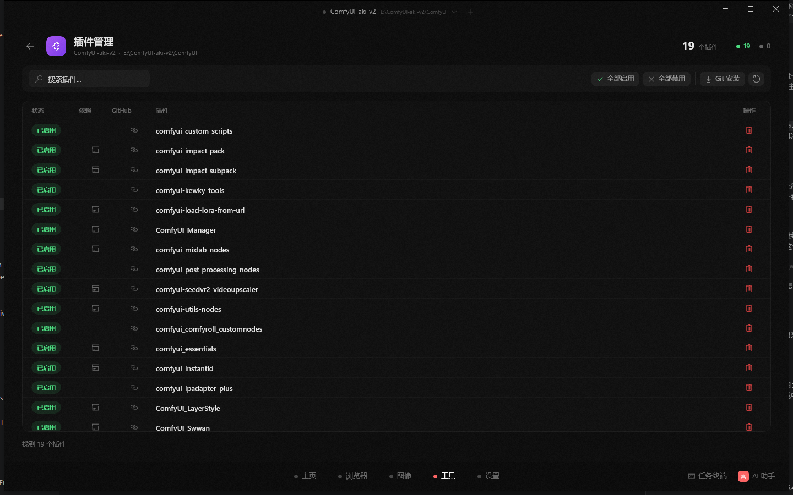
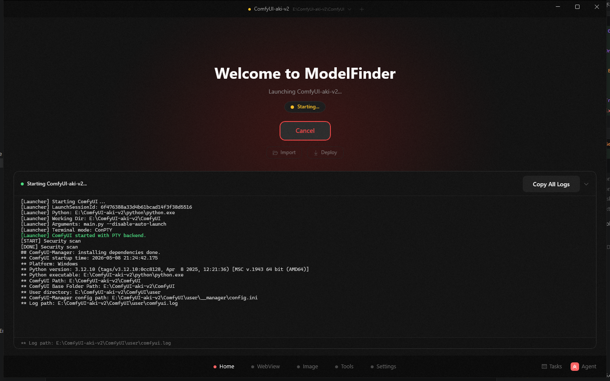

🌐 **English** | [简体中文](README_CN.md)

# Wonderful Launcher for ComfyUI on Windows

### Make downloaded ComfyUI workflows actually run.

[**Download Installer**](https://github.com/hu-haibin/wonderful-launcher-comfyui/releases/tag/v2.1.1) · [**Release Notes**](https://github.com/hu-haibin/wonderful-launcher-comfyui/releases/tag/v2.1.1) · [**Official Website**](https://wonderfullauncher.com/) · [**Docs**](https://wonderfullauncher.com/docs) · [**Report Issues**](https://github.com/hu-haibin/wonderful-launcher-comfyui/issues)

---

## Download

- **Recommended for most users**: [Wonderful Launcher 2.1.1 Setup Installer](https://github.com/hu-haibin/wonderful-launcher-comfyui/releases/tag/v2.1.1)
- **Release notes**: [Wonderful Launcher 2.1.1](https://github.com/hu-haibin/wonderful-launcher-comfyui/releases/tag/v2.1.1)
- **Public stable fallback**: [ModelFinder 2.0.31](https://github.com/hu-haibin/wonderful-launcher-comfyui/releases/tag/v2.0.31)

Open the installer release and download `WonderfulLauncher-Setup-v2.1.1.exe`.

> [!WARNING]
> Do not download GitHub's auto-generated `Source code.zip` or `Source code.tar.gz`. Those are source archives, not runnable Windows desktop builds.

> [!TIP]
> The normal installer is self-contained for desktop runtime needs. You do not need to install Microsoft .NET Desktop Runtime separately.

> [!IMPORTANT]
> If an older build downloads an update but opens the old app again, download and run the latest **Setup Installer** above. The installer is the supported repair path: it keeps your launcher data, moves legacy `ModelFinder` / `Wonderful Launcher` data into `WonderfulLauncher`, cleans old update state, and starts the latest Wonderful Launcher. You do not need to delete old folders by hand.

  

---

## Why This Exists

Getting a ComfyUI workflow is not the same as getting it to run locally.

A workflow you download from the internet may depend on models you do not have, custom nodes that are not installed, Python packages with conflicting versions, a broken PyTorch environment, or files that need to be placed in very specific folders. New users often get stuck before they ever reach the creative part.

Wonderful Launcher turns those scattered maintenance steps into one Windows desktop workflow:

- import an existing ComfyUI Desktop or portable ComfyUI folder
- deploy a fresh ComfyUI package when you want a clean start
- launch ComfyUI and read startup logs in the same app
- find missing workflow models and put them in the right folder
- install missing custom nodes and plugin dependencies
- use launcher-native repair tasks for deterministic startup failures, with Agent kept to bounded diagnosis
- keep image generation history, model management, and runtime settings close by

The goal is not to replace ComfyUI. The goal is to make local ComfyUI easier to keep in a working state.

---

## What You Can Do

| Problem | Wonderful Launcher helps with |
|---------|-------------------------------|
| You already installed ComfyUI Desktop or a portable package | Import it and manage it from one desktop surface. |
| You want a clean ComfyUI install | Pick a disk, choose a runtime package, download, extract, and launch. |
| ComfyUI will not start | Inspect logs, approve the launcher-native repair task, install core requirements and PyTorch, then restart for verification. |
| A workflow says models are missing | Find likely model downloads, copy links, or download into the correct folder. |
| You already downloaded the model yourself | Drag the model file into the app and let the launcher place it where the workflow expects it. |
| A workflow has missing nodes | Install the needed nodes and dependencies without hunting through folders manually. |
| A plugin imports but fails at runtime | Use logs, task-terminal evidence, and bounded diagnosis to work through dependency conflicts and restart verification. |
| You want to generate and reuse images | Use the image workspace, history, reference images, and Photoshop handoff. |

---

## What's new in 2.1.1

Released on July 6, 2026. [Open the full GitHub Release](https://github.com/hu-haibin/wonderful-launcher-comfyui/releases/tag/v2.1.1).

This small desktop update makes the title-bar language control match the language picker in Settings.

- **Direct language selection in the title bar**: the language button now opens a menu instead of cycling through languages one click at a time.
- **Consistent language choices**: Follow system, Traditional Chinese, English, Japanese, and Korean use the same localized options as Settings.
- **Safer language switching**: title-bar labels and selected-state indicators refresh after a language change.
- **Patch release packaging**: desktop version metadata and installer assets are updated to 2.1.1.

---

## Quick Tutorial

### 1. Install Wonderful Launcher

1. Open the [installer download release](https://github.com/hu-haibin/wonderful-launcher-comfyui/releases/tag/v2.1.1).
2. Download `WonderfulLauncher-Setup-v2.1.1.exe`.
3. Run the installer and open Wonderful Launcher.

This repository is the public download and guide page. It is not a public source-code mirror.

### 2. Import an existing ComfyUI

Use this when you already have ComfyUI Desktop, a portable ComfyUI package, or another local ComfyUI folder.

1. Open Wonderful Launcher.
2. Choose **Import ComfyUI**.
3. Select the folder that contains `main.py`, or the portable parent folder that contains a `ComfyUI` subfolder.
4. Start ComfyUI from the Home page and watch the startup log.

Avoid selecting folders such as `models`, `custom_nodes`, `output`, `python_embeded`, or a folder that only contains workflow files.

### 3. Deploy a new ComfyUI

Use this when you want a clean environment instead of repairing an old one.

1. Open ComfyUI settings.
2. Go to the deployment section.
3. Choose the target disk and runtime package for your GPU.
4. Start deployment and wait for download/extraction to finish.
5. Launch the new ComfyUI package from the Home page.

If you prefer an external downloader, you can download the package yourself and then import the extracted folder.

### 4. Run a downloaded workflow

When a workflow opens with red nodes or missing assets, treat that as normal ComfyUI maintenance, not as a personal failure. Most shared workflows depend on specific models, custom nodes, and Python packages.

Wonderful Launcher is designed around that loop:

1. open or import the workflow
2. inspect missing models or nodes
3. install or place what is missing
4. restart or rerun ComfyUI
5. verify that the workflow can generate output

### 5. Fix startup failures

ComfyUI may fail because PyTorch is missing, Python dependencies are broken, a plugin changed the environment, or a runtime package was moved.

Use the startup log and environment pages first. When the cause is not obvious, open the Agent panel. The Agent can read the relevant state, explain likely causes, and propose supported repair actions. Repair actions require your approval.

### 6. Handle missing models

Model files are often large, and the correct target folder is not always obvious. A downloaded workflow may need checkpoints, LoRA, VAE, ControlNet, diffusion models, text encoders, or other model types.

Wonderful Launcher can help you:

- detect missing model names from a workflow
- copy or open download links when available
- download directly into the expected folder
- drag an already-downloaded model file into the app and place it correctly

### 7. Handle missing nodes and plugin errors

ComfyUI workflows often depend on third-party custom nodes. Installing a node can also install Python dependencies, and those dependencies can conflict with the current environment.

Wonderful Launcher helps you install missing nodes, run dependency installs, reopen task terminals, and use logs to verify whether the node actually registered. If a plugin import fails, the Agent can help reason through the error and propose supported repair steps.

---

## Screenshots

  
  
  

  
  
  

---

## Updates

Detailed version changes belong in the GitHub Release notes:

- [Latest Release](https://github.com/hu-haibin/wonderful-launcher-comfyui/releases/latest)
- [Wonderful Launcher 2.1.1 Release Notes](https://github.com/hu-haibin/wonderful-launcher-comfyui/releases/tag/v2.1.1)
- [Wonderful Launcher 2.1.1 Setup Installer](https://github.com/hu-haibin/wonderful-launcher-comfyui/releases/tag/v2.1.1)

---

## FAQ

<b>Why do I still see ModelFinder or mf in some Windows places?</b>

Wonderful Launcher is the public product name. Some internal identifiers intentionally remain `ModelFinder` or `mf` to preserve installed paths, update compatibility, logs, and Windows identity.

<b>Do I need to install Python first?</b>

No. In the normal path, Wonderful Launcher manages the ComfyUI Python environment for you.

<b>Can it manage my existing ComfyUI install?</b>

Yes. Use **Import ComfyUI** and select the folder that contains `main.py`, or the portable parent folder that contains a `ComfyUI` subfolder.

<b>Does the Agent run repair actions automatically?</b>

No. Write or repair actions require your approval. The Agent helps with diagnosis and can run supported launcher tools after you approve them.

<b>Is macOS or Linux supported?</b>

Not currently. This repository publishes Windows desktop builds.

---

## Repository Scope

This repository is the public release home for Wonderful Launcher:

- Windows installer downloads
- release notes
- release screenshots
- issue tracking for released builds

It is not the public source-code repository for the desktop app.

ComfyUI itself is an independent open-source project:

- ComfyUI: https://github.com/comfyanonymous/ComfyUI

---

**Wonderful Launcher** helps keep local ComfyUI workflows runnable on Windows.

