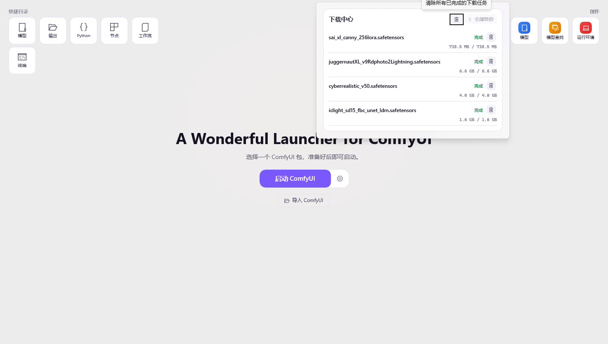

🌐 **English** | [简体中文](README_CN.md)

# ModelFinder for ComfyUI on Windows

### A desktop control center for installing, launching, repairing, and managing ComfyUI.

[**Download Latest Installer**](https://github.com/hu-haibin/wonderful-launcher-comfyui/releases/latest) · [**2.0.22 Notes**](https://github.com/hu-haibin/wonderful-launcher-comfyui/releases/tag/v2.0.22) · [**2.0 Archive**](#20-release-archive) · [**Report Issues**](https://github.com/hu-haibin/wonderful-launcher-comfyui/issues)

---

## Why ModelFinder

ComfyUI is powerful, but Windows setup and maintenance can become messy: Python versions, PyTorch builds, custom nodes, plugin dependencies, workflow assets, model downloads, and launch logs all live in different places.

ModelFinder brings those jobs into one desktop app so ordinary ComfyUI users can:

- deploy or import a ComfyUI environment
- start, stop, and inspect the current runtime
- install custom nodes and plugin dependencies
- scan workflows for missing models or nodes
- manage local model files and download tasks
- diagnose launch failures from real launcher evidence
- ask the AI Assistant to explain and run approved repair steps

  

---

## What's New in 2.0.22

Released on June 1, 2026. [Open the 2.0.22 GitHub Release](https://github.com/hu-haibin/wonderful-launcher-comfyui/releases/tag/v2.0.22).

This release is a workflow download reliability update. It fixes workflow-derived model downloads that need to land under ComfyUI `custom_nodes` instead of the normal `models` tree, while keeping the public installer self-contained and installer-only.

| Area | What changed |
|------|--------------|
| **Custom-node model targets** | Cloud catalog entries can resolve safe `custom_nodes/...` save paths, with traversal and rooted-path guards before anything is written. |
| **Missing-model downloads** | WebView bulk download planning now installs matched workflow assets under either `models` or `custom_nodes`, so custom-node assets land where the node expects them. |
| **Resolver coverage** | Added regression tests for custom-node targets, `models/` prefix normalization, and unsafe custom-node path rejection. |
| **Test environment hardening** | Avalonia mixed UI/non-UI tests now pump initialized dispatcher work more reliably. |
| **Release validation** | Full Release test suite passed with 2,193 tests. The published root smoke launched `ModelFinder.App.exe` from an isolated profile with 0 error/fatal/unhandled log entries. |
| **Release assets** | The public download shape remains the setup installer plus `SHA256SUMS.txt`; no portable package was added. |

  
  
  

---

## 2.0 Release Archive

GitHub Releases are curated for safe public downloads. The intermediate 2.0.0 through 2.0.21 release pages were removed after 2.0.22 so users do not accidentally install a superseded build or the 2.0.7/2.0.8 packaging regression.

| Version | Date | Status | Summary |
|---------|------|--------|---------|
| 2.0.0 | May 7, 2026 | Removed from Releases | First 2.0 commercial-credit build; superseded by startup, update, and localization fixes. |
| 2.0.1 | May 8, 2026 | Removed from Releases | Fixed WinUI startup false failures, ComfyUI Desktop path handling, and startup log recovery. |
| 2.0.2 | May 9, 2026 | Removed from Releases | Added startup auto-update handling and restored core Chinese UI selection. |
| 2.0.3 | May 9, 2026 | Removed from Releases | Localized major WinUI feature pages and refreshed release presentation. |
| 2.0.4 | May 10, 2026 | Removed from Releases | Improved Image Workspace to Photoshop handoff and verified both Photoshop import branches. |
| 2.0.5 | May 11, 2026 | Removed from Releases | Reworked the WinUI light theme, theme switching, and localized Image Workspace controls. |
| 2.0.6 | May 13, 2026 | Removed from Releases | Routed Agent actions through the selected runtime and reduced stale downgrade prompts. |
| 2.0.7 | May 13, 2026 | Removed from Releases | Packaging regression: framework-dependent installer could block on a .NET Desktop Runtime prompt. |
| 2.0.8 | May 13, 2026 | Tag only | Attempted runtime-prerequisite repair for 2.0.7; no public GitHub Release remains. |
| 2.0.9 | May 13, 2026 | Removed from Releases | Corrected the packaging regression by restoring the self-contained public installer. |
| 2.0.10 | May 14, 2026 | Removed from Releases | Added Agent/Image conversion telemetry and task-terminal stability improvements. |
| 2.0.11 | May 16, 2026 | Removed from Releases | Preserved early ComfyUI output and cleaned up task-terminal, stop, and localized message states. |
| 2.0.12 | May 18, 2026 | Removed from Releases | Improved Agent repair handoff, repair progress, refresh timeout behavior, and sanitized feedback context. |
| 2.0.13 | May 19, 2026 | Removed from Releases | Removed unfinished Tools placeholders and improved deployment/import selection and release caching. |
| 2.0.14 | May 19, 2026 | Removed from Releases | Hotfix for task-terminal evidence, plugin install state, deployment completion, and large reference-image upload. |
| 2.0.15 | May 21, 2026 | Removed from Releases | Improved missing-node repair handoff, task isolation, delayed context status, and redacted Agent feedback evidence. |
| 2.0.16 | May 23, 2026 | Removed from Releases | Improved startup recovery, runtime convergence, plugin repair verification, package cleanup, and initial Image workspace smoke coverage. |
| 2.0.17 | May 25, 2026 | Removed from Releases | Added recoverable online Image tasks, cloud result mirroring, Worker polling fallback, local history pagination, and broader Image smoke coverage. |
| 2.0.18 | May 25, 2026 | Removed from Releases | Improved desktop sign-in fallback, credit checkout flow, low-credit Image package selection, Image funnel telemetry, update proxy downloads, and Photoshop gating. |
| 2.0.19 | May 27, 2026 | Removed from Releases | Added authenticated Image result download fallback, task ownership checks, history recovery metadata, and release-path settings handoff fixes. |
| 2.0.20 | May 28, 2026 | Removed from Releases | Routed update downloads through the Wonderful Launcher proxy/CDN, added update source controls, improved update cancellation, and pre-uploaded Image references. |
| 2.0.21 | May 31, 2026 | Removed from Releases | Removed an Image history thumbnail tooltip crash path, added a regression guard, and revalidated the real online Image path. |

For normal installation, use the latest release only.

---

## Core Workflows

| Workflow | What ModelFinder provides |
|----------|---------------------------|
| **Install or import ComfyUI** | Deploy a new environment or attach an existing ComfyUI folder without guessing which subfolder to choose. |
| **Launch and inspect runtime** | Start/stop ComfyUI, view live logs, open the built-in workspace, and check runtime state from the Home page. |
| **Repair custom nodes** | Detect missing nodes, install ComfyUI-Manager when needed, create terminal tasks, restart, and verify registration. |
| **Manage plugins** | Install custom nodes from Git URLs, enable/disable plugins, remove plugins, and run dependency installs. |
| **Find missing models** | Drop a workflow file, detect missing model references, and match downloadable candidates from supported catalogs. |
| **Manage downloads** | Queue, track, pause, resume, and review model download tasks inside the launcher. |
| **Use AI assistance** | Ask for diagnosis, approve repair tools, and keep multi-step repair evidence in one conversation. |

---

## Feature Gallery

  
  
  

  
  
  

---

## AI Assistant Boundaries

The Assistant is built into the desktop app, but it is not a free-form shell.

It can:

- read launcher-collected logs and selected-environment state
- explain startup failures, dependency errors, and plugin failures
- inspect missing-node and missing-model evidence
- call supported launcher tools after approval
- create task-terminal jobs for long-running installs
- continue repair flows in the same conversation
- use local preferences and project hints when personalization is enabled

It does not:

- bypass user approval for write or repair actions
- change billing or credit rules
- upload local personalization memory as default cloud content
- send full terminal logs, system prompts, workflow files, tokens, or raw environment dumps as feedback data

AI features require sign-in and are credit-based. Current billing rules live on the official service, not in this release repository.

---

## Quick Start

### Install

1. Open the [latest GitHub Release](https://github.com/hu-haibin/wonderful-launcher-comfyui/releases/latest).
2. Download `ModelFinderLauncher-Setup-v*.exe`.
3. Run the installer and open ModelFinder.

> [!WARNING]
> Download the **Setup Installer** from the release assets. Do **not** download GitHub's auto-generated `Source code.zip` or `Source code.tar.gz`. Those are source archives, not runnable desktop builds.

> [!TIP]
> The normal installer is self-contained for desktop runtime needs. You do not need to install Microsoft .NET Desktop Runtime separately.

### Import an existing ComfyUI

1. Open ModelFinder on the Home page.
2. Click **Import ComfyUI**.
3. Select the folder that contains `main.py`, or the portable parent folder that contains a `ComfyUI` subfolder.
4. Start ComfyUI from the Home page.

Avoid selecting these folders by mistake:

- `models`
- `custom_nodes`
- `output`
- `python_embeded`
- a folder that only contains workflow files

---

## Current Product Notes

- **Platform**: Windows 10 / 11
- **Release type**: public Windows installer
- **Cloud-backed features**: AI Assistant and some workflow matching features require sign-in and server-side services
- **Local data**: launcher configuration, logs, package state, and optional personalization data stay on the local machine unless a feature explicitly sends a request to the service
- **Prereleases**: beta builds, if available, are marked separately in GitHub Releases

---

## FAQ

<b>Do I need to install Python first?</b>

No. For standard use, ModelFinder manages the ComfyUI Python environment for you.

<b>Can it manage my existing ComfyUI install?</b>

Yes. Use **Import ComfyUI** and select the folder that contains `main.py`, or the portable parent folder that contains a `ComfyUI` subfolder.

<b>Does it support custom nodes?</b>

Yes. You can install custom nodes from Git URLs, manage dependencies, enable or disable plugins, and use Agent-assisted missing-node repair.

<b>Does the AI Assistant run actions automatically?</b>

It can run supported repair tools only after approval for write or repair actions.

<b>Is macOS or Linux supported?</b>

Not currently. This release repository publishes Windows builds.

---

## About This Repository

This repository hosts:

- compiled Windows installer releases
- full notes for the current release and the 1.5.3 stable line
- the compact 2.0 archive above for internal release history
- public issue tracking for released builds

ModelFinder is a closed-source desktop product built around the ComfyUI ecosystem.

ComfyUI is an independent open-source project:

- ComfyUI: https://github.com/comfyanonymous/ComfyUI

---

**ModelFinder**: a Windows control center for ComfyUI environments.

