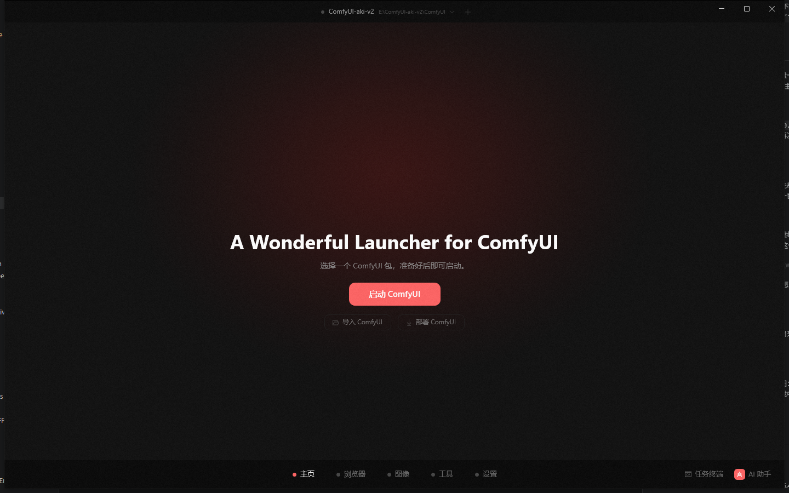
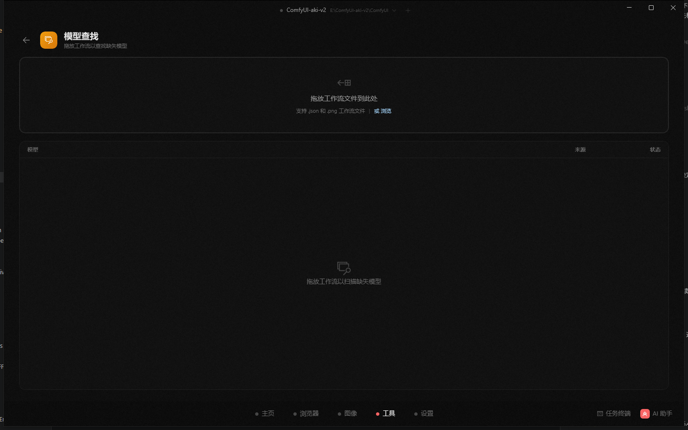
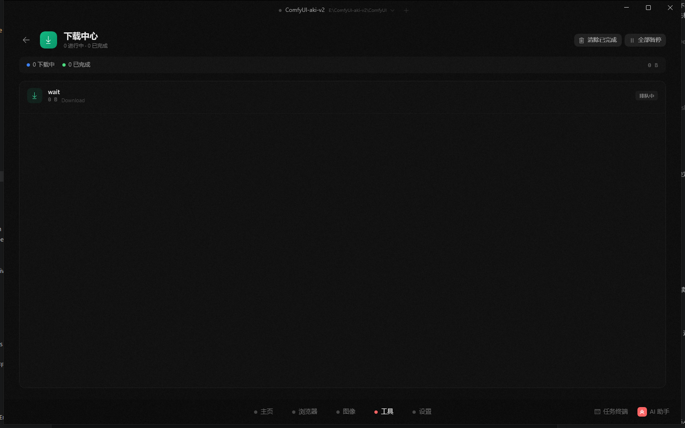

🌐 **English** | [简体中文](README_CN.md)

# ModelFinder for ComfyUI on Windows

### Deploy, launch, manage, and repair ComfyUI from one desktop app.

[**Download**](https://github.com/hu-haibin/wonderful-launcher-comfyui/releases/latest) · [**What's New in 2.0.7**](release-notes/2.0.7.en.md) · [**All Releases**](https://github.com/hu-haibin/wonderful-launcher-comfyui/releases) · [**Report Issues**](https://github.com/hu-haibin/wonderful-launcher-comfyui/issues)

---

## What ModelFinder Is

ModelFinder is a Windows desktop launcher and manager for the ComfyUI ecosystem.

It is built for the messy parts around ComfyUI:

- deploying a fresh environment
- managing multiple ComfyUI installs
- checking Python / PyTorch / dependency state
- installing custom nodes and their dependencies
- scanning workflows for missing assets
- downloading models from supported sources
- diagnosing launch and environment failures

The goal is simple: spend less time fixing setup and more time running workflows.

---

## What's New in 2.0.7

Released on May 13, 2026. [Read the full 2.0.7 release notes](release-notes/2.0.7.en.md).

- **Startup repair can finish the loop**: the AI Assistant can restore missing ComfyUI core dependencies, install the right PyTorch runtime, and hand you back to the Home page so ComfyUI can start again.
- **Theme and language switching is cleaner**: WinUI pages, cards, assistant replies, image tools, WebView surfaces, and small status labels now update colors and copy more consistently after theme or language changes.
- **Release startup is hardened for .NET 10 / WinUI**: the public package now avoids the self-contained WinRT projection crash path and the installer checks for Microsoft .NET Desktop Runtime 10.x before setup continues.
- **Environment state refreshes after repairs**: dependency and PyTorch repairs triggered by the Assistant now notify the Environment page so package/runtime state can update without a manual detour.

  
  

---

## Recent Product Highlights

- **Live image generation progress**: image generation surfaces queue, status, and progress feedback while a job is running.
- **Stronger AI diagnosis**: the Assistant can work from launcher logs, startup failures, task terminal evidence, and selected-environment state before suggesting repairs.
- **Local personalization controls**: when enabled, local preferences and project hints can make replies feel more familiar without changing permissions, billing, or safety rules.
- **Safer update handling**: update checks are designed to avoid confusing downgrade or migration prompts when the installed build is already current or newer.

---

## Feature Gallery

Fresh real-app captures from the current WinUI public build's core surfaces.

  
  
  

  
  
  

- **Home**: start ComfyUI from the main launch surface and keep the launcher centered on the primary workflow.
- **Environment**: inspect Python, PyTorch, ComfyUI, disk usage, and installed packages in one place.
- **Plugin Manager**: enable, disable, install, and remove custom nodes from a dedicated plugin view.
- **Model Manager**: browse local checkpoints and other model files across the active environment.
- **Model Finder**: drop a workflow to scan for missing model references before execution.
- **Download Center**: track queued and completed downloads from the launcher.

---

## Core Capabilities

| Area | What it does |
|------|---------------|
| **Home** | Start and stop ComfyUI, view live logs, open the built-in workspace, inspect basic hardware and runtime status |
| **Environments** | Deploy ComfyUI, manage multiple installs, switch ComfyUI / PyTorch variants, install `.txt` and `.whl` dependencies |
| **Workflows** | Analyze workflow files, detect missing models, and resolve downloadable candidates from supported catalogs |
| **Plugins** | Install custom nodes from Git URLs, manage plugin dependencies, bulk enable or disable plugins |
| **Models** | Browse local model libraries, detect duplicates across packages, and manage downloads |
| **Image** | Generate images from prompts, follow live status/progress, inspect generated outputs, and send results to Photoshop |
| **AI Assistant** | Read launcher evidence, explain failures, and execute approved repair actions inside the launcher |
| **Downloads** | Queue, track, pause, resume, and manage model downloads |

---

## AI Assistant

The AI Assistant is integrated into the desktop app as a chat panel.

What it can do today:

- inspect launcher-collected logs and environment state
- inspect startup failures, task terminal output, and selected-environment context
- explain startup failures, dependency errors, and plugin install failures
- suggest repair actions
- execute launcher-native repair tools after your approval
- continue multi-step repair flows inside the same conversation
- use local preferences and project hints when personalization is enabled

Important boundaries:

- AI features require sign-in
- usage is credit-based and managed server-side
- current billing and pricing rules live on the official website, not in this release repo
- local personalization does not bypass approvals, elevate tool permissions, or change billing behavior
- local personalization memory is not treated as default cloud sync content

---

## Quick Start

### Install ModelFinder

1. Open [Releases](https://github.com/hu-haibin/wonderful-launcher-comfyui/releases/latest)
2. Download the latest **Setup Installer** asset
3. Run the installer and open ModelFinder

> [!WARNING]
> Download the **Setup Installer** from the release assets. Do **not** download GitHub's auto-generated `Source code.zip` or `Source code.tar.gz`. Those are source archives, not runnable desktop builds.

> [!TIP]
> ModelFinder manages the ComfyUI Python environment for you. The Setup Installer checks for Microsoft .NET Desktop Runtime 10.x and will tell you if that Windows runtime needs to be installed first.

  

### Import an existing ComfyUI

1. Open ModelFinder and stay on the Home page
2. Click **Import ComfyUI**
3. Pick your existing ComfyUI folder
4. After the import succeeds, click **Start** to launch ComfyUI

The safest folder choices are:

- the folder that directly contains `main.py`
- the portable parent folder if it contains a `ComfyUI` subfolder

Do **not** select these by mistake:

- `models`
- `custom_nodes`
- `output`
- `python_embeded`
- a workflow-only folder

### Existing installs

ModelFinder can work with:

- existing ComfyUI portable folders
- multiple side-by-side ComfyUI installs
- ComfyUI Desktop environments imported through your `Documents\\ComfyUI` folder

ModelFinder is meant to manage and inspect these environments, not overwrite them blindly.

### Common import and launch confusion

- **Wrong folder selected**: if ModelFinder says the selected folder is missing `main.py`, you picked the wrong directory. Go back and select the real ComfyUI root instead.
- **Imported successfully, but launch still failed**: first check the app window title bar at the very top. If it already shows a resolved path such as `...\\ComfyUI_windows_portable\\ComfyUI`, ModelFinder already found your runtime. That is usually **not** a wrong-folder problem. Then check the log panel on the Home page for runtime errors such as missing `dll`, `torch`, `roc_sdk`, or other dependency failures.
- **Still unsure which folder to import**: import the folder that contains `main.py`, or the parent portable folder that contains a `ComfyUI` subfolder.

---

## Current Product Notes

- **Platform**: Windows 10 / 11
- **Release type**: this repository publishes public Windows builds
- **Prereleases**: if beta or prerelease builds are available, they will be explicitly marked in GitHub Releases
- **Cloud-backed features**: AI Assistant and some workflow matching capabilities rely on sign-in and server-side services
- **Local data**: launcher configuration, logs, package state, and optional personalization data stay on the local machine unless a feature explicitly sends a request to the service

---

## FAQ

<b>Do I need to install Python first?</b>

No. For standard use, ModelFinder manages the ComfyUI Python environment for you.

<b>Can it manage my existing ComfyUI install?</b>

Yes. Click **Import ComfyUI** on the Home page, select the folder that contains `main.py` or the portable parent folder that contains a `ComfyUI` subfolder, and let ModelFinder manage it alongside new environments.

<b>Does it support custom nodes?</b>

Yes. You can install custom nodes from Git URLs and manage their Python dependencies from inside the app.

<b>Does the AI Assistant run actions automatically?</b>

It can execute supported repair tools, but only after approval for write or repair actions.

<b>Is macOS or Linux supported?</b>

Not currently. This release repository is for Windows builds.

---

## About This Repository

This repository hosts:

- compiled Windows releases
- [versioned release notes](release-notes/) and release history
- issue tracking for public builds

ModelFinder itself is a closed-source desktop product built around the ComfyUI ecosystem.

ComfyUI is an independent open-source project:

- ComfyUI: https://github.com/comfyanonymous/ComfyUI

---

**ModelFinder** — a Windows control center for ComfyUI environments.

