🌐 [English](README.md) | **简体中文**

<div align="center">

# ModelFinder

### 🚀 让 ComfyUI 工作流在 Windows 上更快跑起来

**批量工作流分析 · 缺失资源下载 · 加速下载流程**

[](https://github.com/hu-haibin/ModelFinder-Releases/releases/latest)
[](https://github.com/hu-haibin/ModelFinder-Releases/releases)
[](https://github.com/hu-haibin/ModelFinder-Releases/releases/latest)

[**📥 Stable 社区版**](https://github.com/hu-haibin/ModelFinder-Releases/releases/latest) · [**🧪 Beta / 抢先体验**](https://github.com/hu-haibin/ModelFinder-Releases/releases) · [**📋 更新日志**](https://github.com/hu-haibin/ModelFinder-Releases/releases) · [**🐛 反馈问题**](https://github.com/hu-haibin/ModelFinder-Releases/issues)

---

</div>

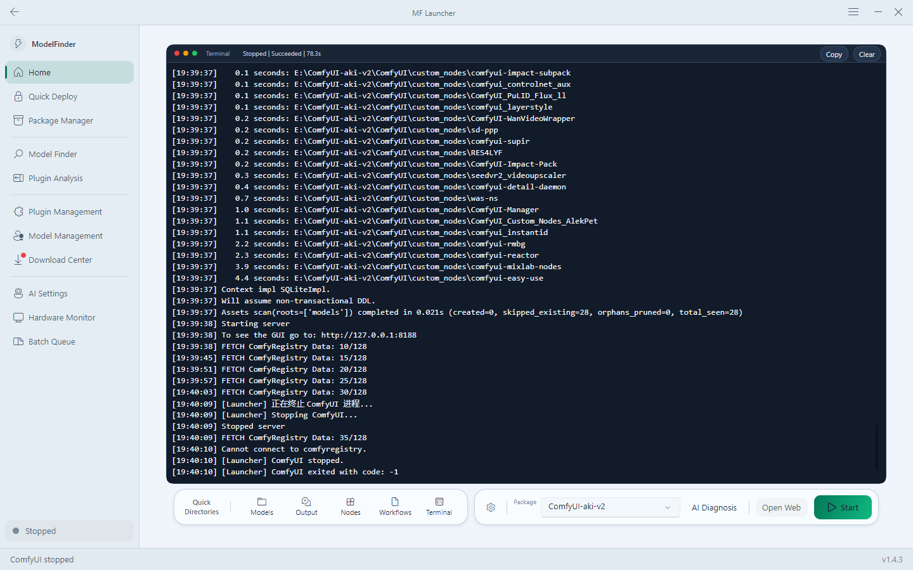

## ✨ 它解决什么问题？

ModelFinder 是一款面向 **ComfyUI** 用户的 Windows 启动器与工作流操作工具，核心目标是把“导入工作流 -> 检查缺失资源 -> 完成下载 -> 启动运行”这一整段流程做得更快。它适合需要批量检查工作流、定位缺失模型与相关资源、并高效完成下载准备的用户。

> 💡 不用再逐个打开工作流、手动追缺文件、反复切换多个 ComfyUI 环境。你可以在一个入口里完成分析、下载与启动。

---

## 🧭 发布路径

| 路径 | 访问方式 | Release 类型 | 适合人群 |
|------|----------|--------------|----------|
| **Stable 社区版** | 免费 | 标准 GitHub release | 绝大多数希望使用公开稳定版本的用户 |
| **Pro / Beta 抢先体验** | 付费内测 | GitHub prerelease | 希望更早拿到工作流工具能力、接受更快迭代节奏的付费测试用户 |

### 🔓 Pro / Beta 当前重点开放

- **批量工作流分析**，支持多文件和整文件夹检查
- **一键下载缺失资源**，包括模型及部分依赖相关资源
- **加速下载流程**，适合大体量下载任务和重复部署场景
- **处于 active testing 的进阶自动化能力**，包括更高阶的工作流工具链与 AI 辅助诊断

### 🧪 Beta Access 说明

本仓库继续保留免费社区版，但也会在同一发布页维护 **付费 Beta 通道**。

- **Stable 社区版** 仍然是默认推荐下载路径
- **Pro / Beta 抢先体验** 面向已获得资格或许可的付费测试用户
- Beta 版本可能包含未完全定型的功能、界面调整或阶段性回归
- Stable 与 Beta 继续共用同一仓库，便于统一下载入口、版本历史与升级路径

适合加入的人群：经常处理缺失模型、批量检查工作流、维护多个 ComfyUI 环境的用户，以及想提前体验批量分析、批量补全下载与进阶自动化能力的重度用户。

---

## 🎯 你可以用它做什么

### 🖱️ 一键部署 ComfyUI

无需手动配置 Python 环境，只需几次点击即可完成从零到可运行的全流程：

- **版本选择**：从 ComfyUI 官方 Release 列表中选择版本，自动下载
- **GPU 加速选择**：提供 4 种模式 —— NVIDIA 默认 / CUDA 12.6 / CUDA 12.8（推荐） / AMD ROCm
- **可选预装组件**：部署时可勾选安装 ComfyUI-Manager、DD 中文翻译、KJ Nodes、WAN Video Wrapper 等常用插件
- **可视化安装进度**：分步骤进度条展示（下载 → 解压 → 安装组件），告别黑窗口焦虑
- **故障恢复**：下载失败可切换镜像源重试、导入本地安装包、或跳过失败步骤
- **部署完成后一键启动**：完成后直接点击「启动 ComfyUI」

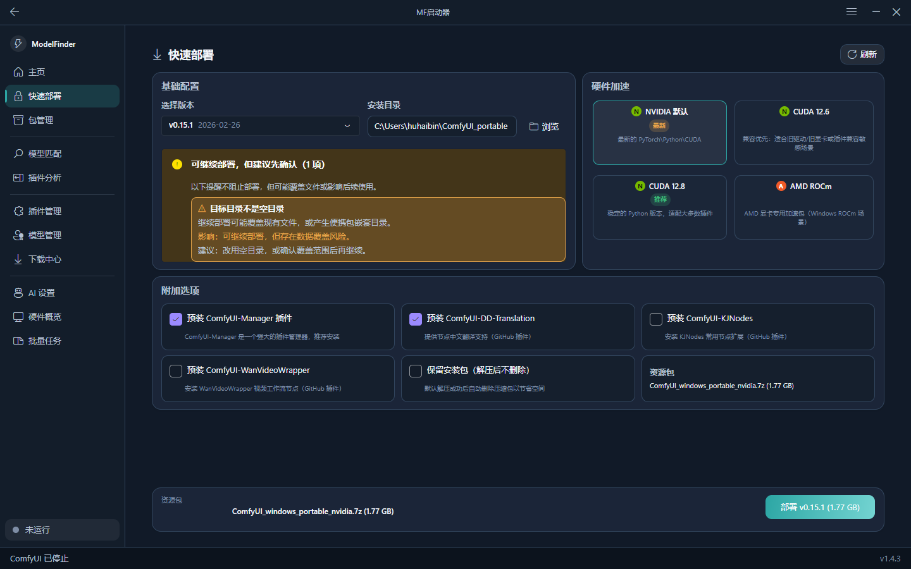

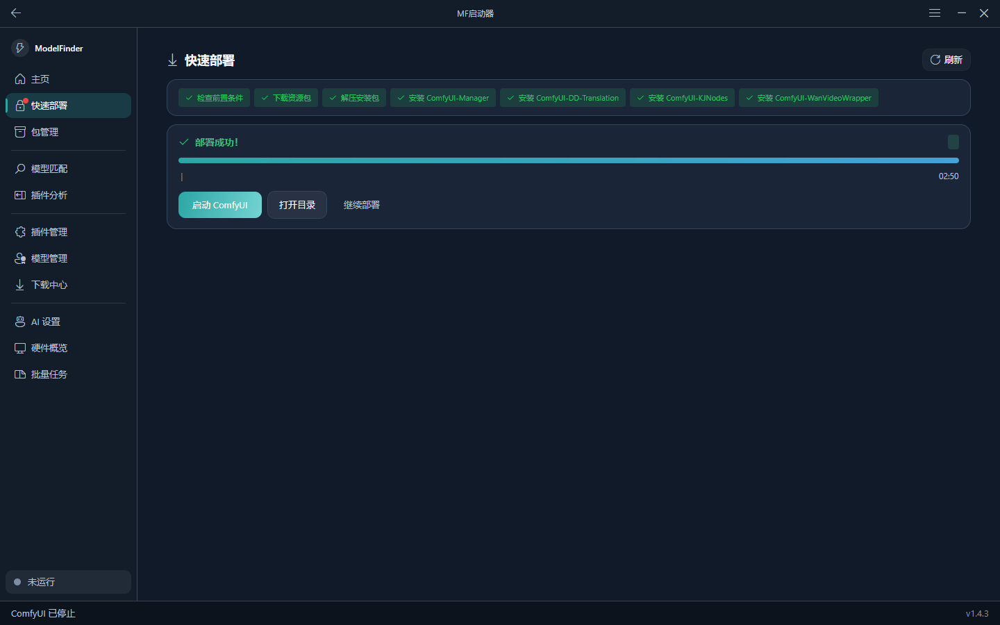

---

### 🏠 首页：控制台 + 悬浮操作岛

启动器的核心界面，借鉴游戏启动器的交互设计：

- **全屏终端控制台**：实时显示 ComfyUI 运行日志，带 macOS 风格装饰栏（红黄绿三点），支持复制/清空
- **右下角悬浮操作岛**：一键启动/停止 ComfyUI、打开 Web UI、切换实例
- **启动参数配置**：齿轮弹窗内设置端口号、GPU 显存模式（High/Normal）、自定义启动参数
- **快捷目录入口**：底部工具条一键打开 models / output / custom_nodes / workflows 目录和 Python 终端
- **环境自动校验**：启动前检测 Python、GPU 等环境，异常时提供端口冲突解决方案

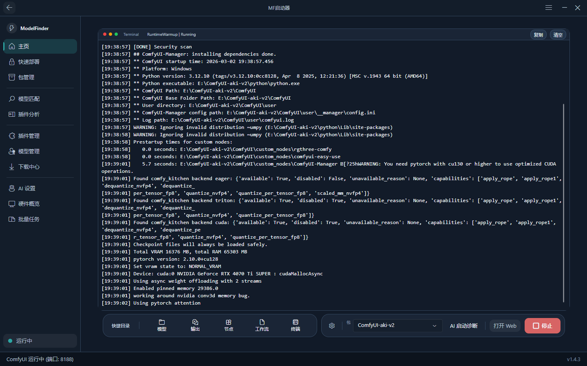

---

### 🤖 AI 智能诊断

当 ComfyUI 启动失败或运行异常时，AI 助手自动帮你排查问题：

- **一键分析日志**：将最近的控制台日志发送给 AI 进行诊断
- **自动生成修复方案**：AI 给出具体的修复命令（pip install / git 操作等）
- **用户确认后执行**：修复命令需用户审批后才会执行，高风险操作有二次确认
- **执行后自动验证**：修复完成后自动重启 ComfyUI 验证是否修复成功
- **一键回滚**：如果修复效果不佳，可一键回滚变更
- **支持多种 AI 服务商**：在 AI 设置页配置 API Key 即可使用（支持自定义 API 端点）

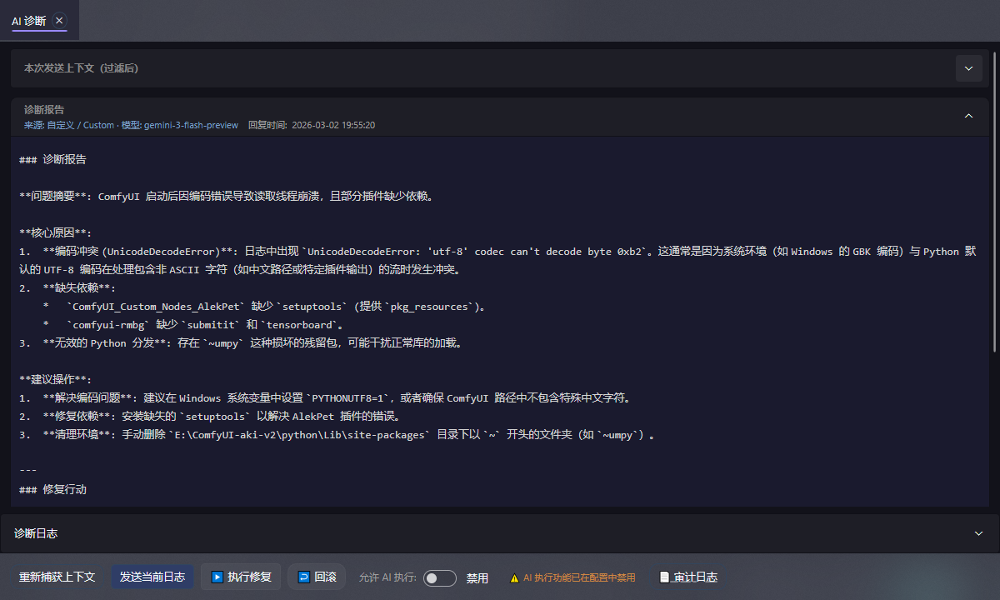

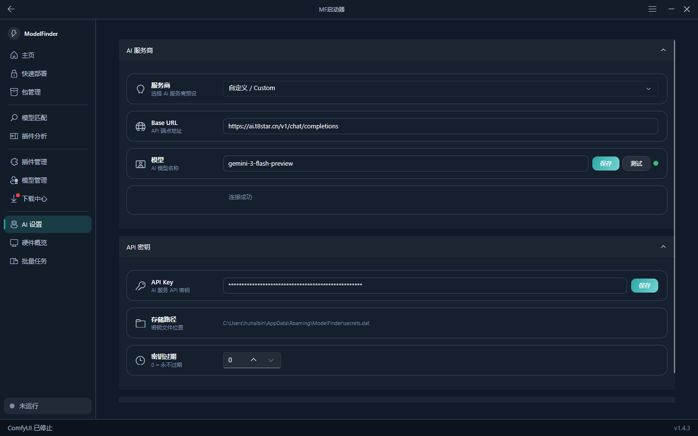

---

### 🔍 Model Finder — 模型智能匹配

核心差异化功能：加载工作流，自动找到缺失的模型并匹配下载源。

- **拖拽或浏览加载工作流**：支持 JSON / PNG 格式的 ComfyUI 工作流文件
- **自动扫描已有模型**：对照当前实例的 models 目录，识别「已有」与「缺失」
- **多源自动匹配**：从内置模型目录（1000+ 条）中匹配候选，来源覆盖 HuggingFace / HuggingFace Mirror / ModelScope
- **在线搜索补充**：对于未自动匹配的模型，支持 Civitai / HuggingFace / Bing 在线搜索
- **逐个或批量操作**：确认候选 / 拒绝匹配 / 下载单个 / 一键下载全部已匹配模型
- **批量分析**：支持选择多个工作流文件、或直接选择整个文件夹批量分析
- **结果导出**：分析结果可导出为 CSV / JSON，方便记录和分享

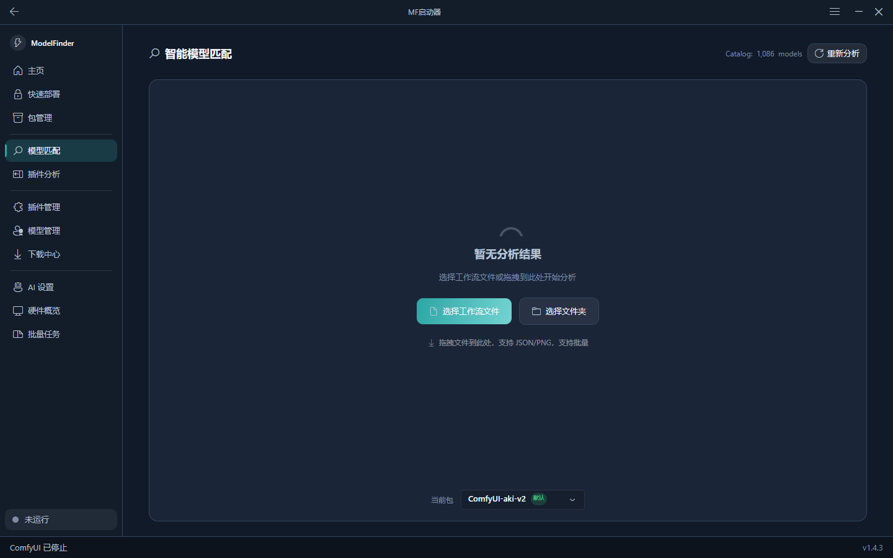

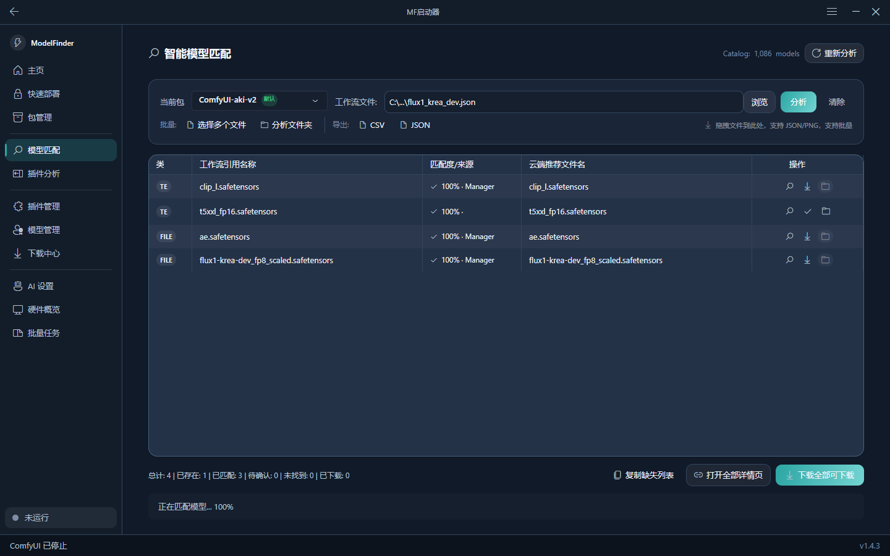

---

### 🧩 依赖分析（工作流插件分析）

综合分析工作流所需的自定义节点插件：

- **插件依赖检测**：识别工作流所需的自定义节点插件，列出已安装 / 缺失
- **一键安装缺失插件**：通过 Git Clone 自动安装缺失的 custom_nodes
- **自动安装 Python 依赖**：安装插件后自动运行 pip install requirements
- **批量分析**：支持多文件 / 整文件夹批量分析

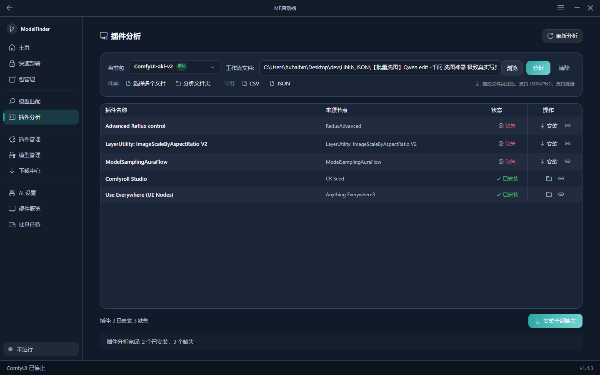

---

### 📦 实例/包管理

管理多个 ComfyUI 安装环境（便携包）：

- **接管现有便携包**：直接添加已有的 ComfyUI 目录，不修改原有配置
- **版本信息一览**：每个实例显示 Python 版本（含环境类型）、PyTorch 版本、ComfyUI 版本、插件数量、磁盘占用
- **设为默认实例**：一键切换首页启动的默认包
- **PyTorch 版本管理**：查看/切换 PyTorch 版本（CUDA 11.8 / 12.1 / 12.6 / 12.8 等）
- **ComfyUI 内核升级**：查看内核版本列表，一键升级或回滚
- **环境导出/导入**：导出 `pip freeze` 环境配置，或从配置文件导入还原环境
- **终端工具**：直接打开 Python 终端，执行 pip list / pip install / pip uninstall / pip show
- **pip 缓存清理**：释放 pip 下载缓存空间

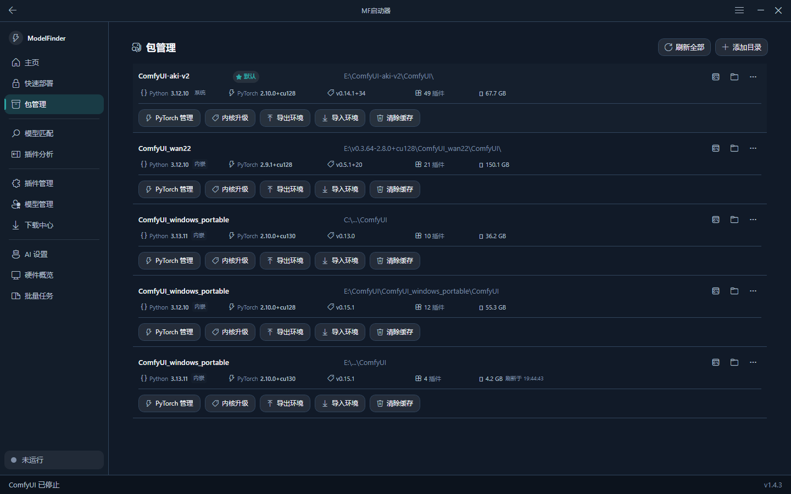

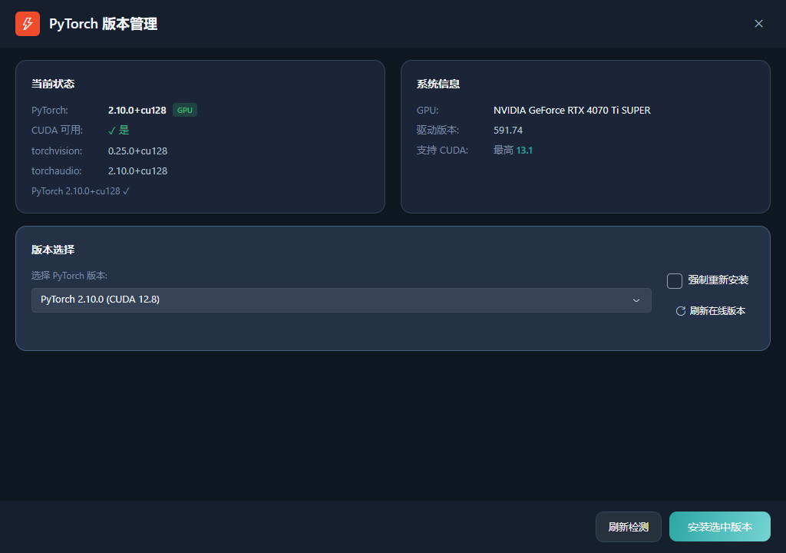

---

### 🧰 插件管理

已安装自定义节点的专属管理页面：

- **自动扫描**：扫描 custom_nodes 目录，获取插件名称、Git 远程 URL、大小等信息
- **搜索与筛选**：按名称搜索，快速定位插件
- **插件操作**：打开文件夹 / 打开 GitHub 页面 / 删除插件
- **版本切换**：查看插件的 Git 提交历史，切换到指定版本
- **插件回滚**：回滚到上一个 Git 提交
- **依赖管理**：检测并安装插件的 Python 依赖

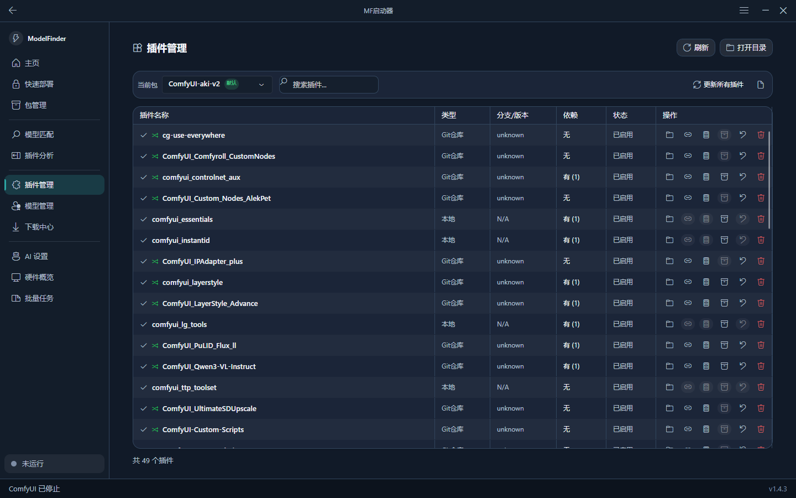

---

### 📊 硬件监控

实时了解你的硬件运行状况：

- **硬件配置**：系统版本、CPU 型号、内存、显卡型号与显存、主板信息
- **磁盘空间**：各分区容量 / 已用 / 剩余空间，可视化进度条
- **网络验证**：内置多节点测速（HuggingFace / ModelScope / GitHub / Civitai 等），自动推荐最佳下载源
- **配置报告**：一键复制完整硬件 + 网络报告到剪贴板，方便求助

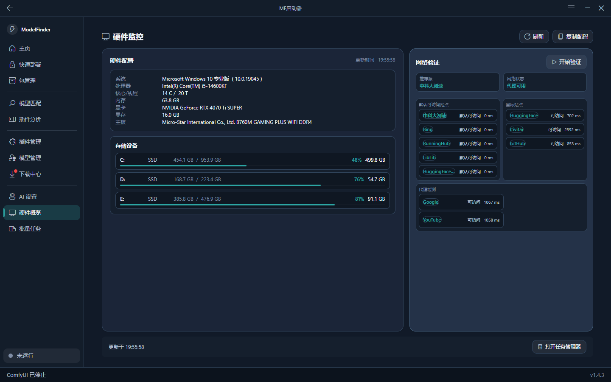

---

### 🔄 批量出图（Batch Queue）

通过 ComfyUI API 自动化批量生成：

- **加载工作流 JSON**：选择要批量执行的 ComfyUI 工作流
- **指定替换参数**：设置目标节点 ID 和字段名，支持从提示词文件批量替换
- **重复次数 / 随机种子**：设定重复执行次数，可开启随机种子
- **自动重启间隔**：设置 ComfyUI 自动重启间隔，避免内存泄漏
- **自定义输出目录**：指定图片输出路径
- **可断点恢复**：批量任务意外中断后，恢复进度继续执行

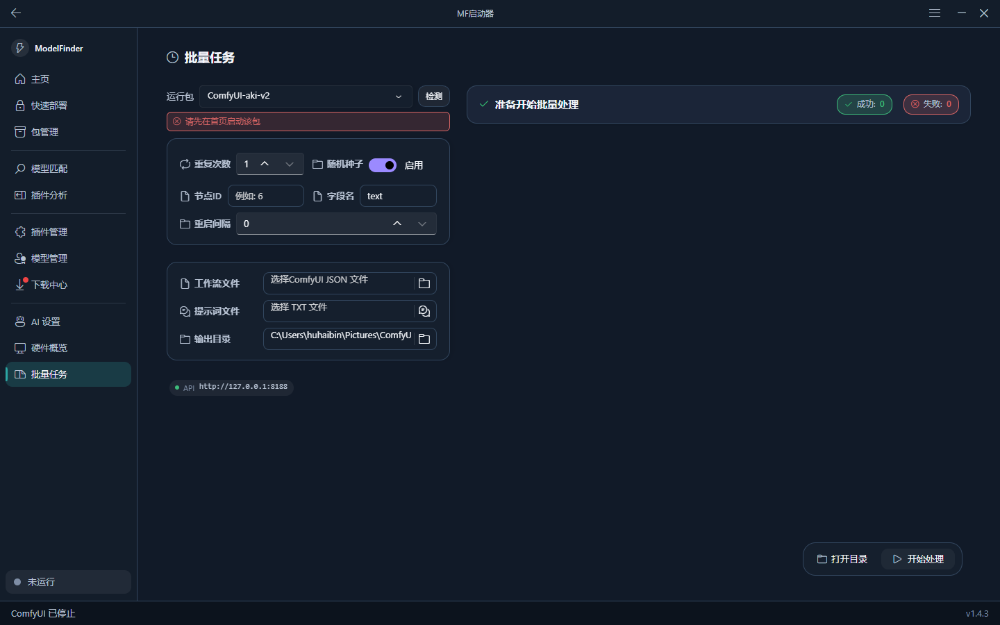

---

### 📁 模型管理

本地模型文件的可视化浏览与管理：

- **模型扫描**：扫描模型目录，按分类浏览已有模型
- **搜索与筛选**：按文件名搜索，按类型（checkpoint / lora / vae 等）分类筛选
- **信息展示**：文件名、类型、大小一目了然
- **快捷操作**：打开所在目录、删除模型

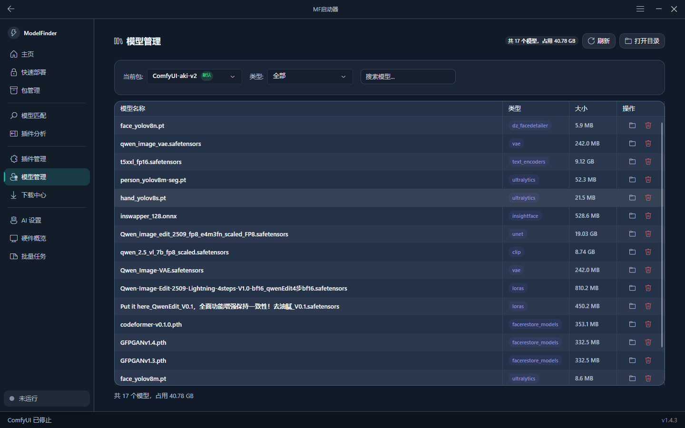

---

### ⬇️ 下载中心

全局下载任务管理中心，所有模型下载任务统一管理：

- **实时进度**：显示下载速度、已下载大小、剩余时间、完成百分比
- **任务控制**：暂停 / 恢复 / 取消下载
- **批量管理**：一键清除已完成任务
- **路径详情**：展开查看下载目标路径

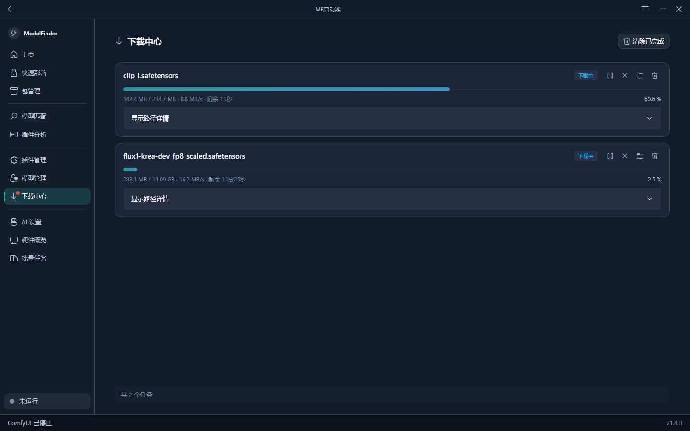

---

### ⚙️ 设置

丰富的个性化配置：

- **界面语言**：简体中文 / English / 跟随系统，切换后即时生效
- **界面主题**：深色 / 浅色模式切换
- **配色方案**：海洋蓝等多种主题配色方案
- **界面密度**：舒适 / 紧凑模式，适配不同屏幕尺寸
- **减少动画**：可关闭过渡动画，提升低配体验
- **侧边栏状态**：控制启动时侧边栏默认展开或收起

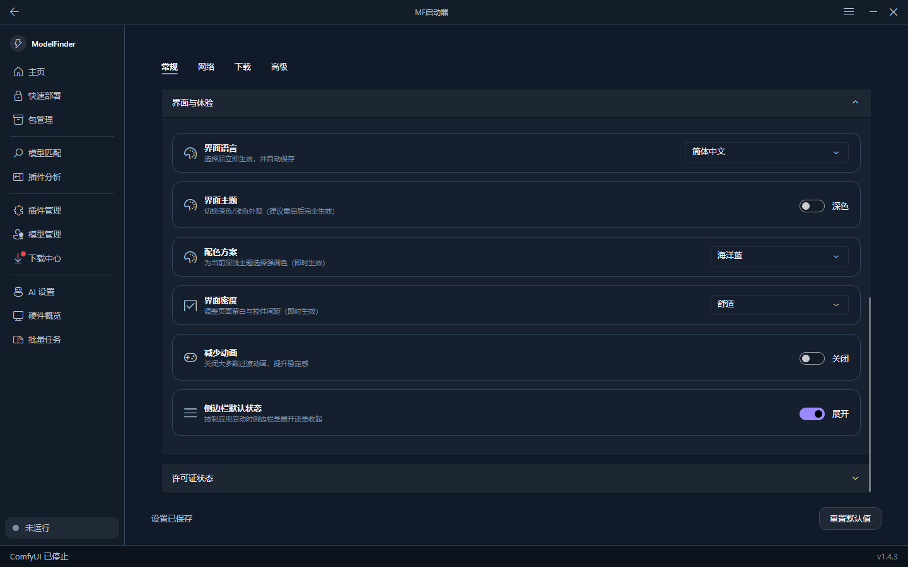

---

## 🎨 用户界面

ModelFinder 采用 **Windows Fluent Design** 设计语言，提供现代、沉浸式的操作体验：

- 🌙 **深色/浅色主题**：深色主题精心调校，浅色主题同样美观
- ✨ **流畅动画**：页面切换与交互动效丝滑流畅（可在设置中关闭）
- 📐 **密度可调**：紧凑模式 / 舒适模式，适配不同屏幕
- 🌐 **双语切换**：中文 / English 实时切换，无需重启
- 🎮 **游戏启动器式交互**：右下角悬浮操作岛、macOS 风格终端装饰
- 📌 **可收起侧边栏**：12 个导航入口，侧边栏可折叠

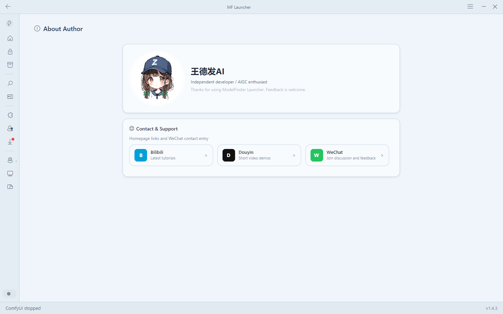

---

## 💻 系统要求

| 项目 | 要求 |
|------|------|
| **操作系统** | Windows 10 (22H2+) / Windows 11 |
| **运行时** | 无需额外安装（已内置） |
| **磁盘空间** | 启动器本体 ~100 MB |
| **显卡** | 运行 ComfyUI 建议 NVIDIA GPU（支持 CUDA）或 AMD GPU（支持 ROCm） |

> 📌 ModelFinder 本身是启动器/管理工具，ComfyUI 的运行需求取决于你要跑的模型和工作流。

---

## 📥 安装与使用

### 下载安装

普通用户可从 [**latest release**](https://github.com/hu-haibin/ModelFinder-Releases/releases/latest) 获取最新 Stable 社区版。
已获得资格的抢先体验用户可在同一个 [**Releases 页面**](https://github.com/hu-haibin/ModelFinder-Releases/releases) 获取带有 prerelease 标记的 Beta 版本。

| 方式 | 文件 | 说明 |
|------|------|------|
| **Setup 安装包** | `ModelFinderLauncher-Setup-vX.X.X.exe` | 推荐 — 标准安装/卸载流程，自动创建开始菜单快捷方式 |
| **免安装 ZIP** | `ModelFinderLauncher-win-x64-portable-vX.X.X.zip` | 解压即用 — 解压到任意目录，运行 `ModelFinder.exe` 启动 |

> 💡 两种方式均无需额外安装 Python 或 .NET 运行时，开箱即用。

### 快速上手

```
首次启动 → 部署向导安装 ComfyUI（选版本/GPU/组件，一键部署）
         → 或者在「包管理」页添加已有的 ComfyUI 便携包

首页     → 点击启动按钮 → 控制台实时显示日志 → Ready 后点击「打开 Web」

Model Finder → 拖入工作流文件 → 自动检测缺失模型 → 确认匹配 → 下载全部

依赖分析    → 加载工作流 → 检测缺失插件 → 一键安装

批量出图    → 加载工作流 → 设置参数 → 开始批量生成
```

---

## 🔄 从旧版升级

如果你之前使用的是 **ComfyLauncher**（v1.3.x 及更早版本）：

- ModelFinder 会**自动迁移**你的配置数据（`%AppData%/ComfyLauncher` → `%AppData%/ModelFinder`）
- 新旧可执行文件名均可识别（`ComfyLauncher.exe` / `ModelFinder.exe`），升级无缝
- 首次通过旧入口启动时会显示品牌变更提示

---

## ❓ 常见问题

<details>
<summary><b>Q: ModelFinder 和绘世启动器有什么区别？</b></summary>

两款都是优秀的 ComfyUI 启动管理工具，侧重点不同：

- **Model Finder（模型匹配）**：ModelFinder 的核心差异化 —— 自动解析工作流、匹配缺失模型的下载源（HuggingFace/ModelScope/Civitai），大幅缩短「拿到别人工作流但缺模型」的排查时间
- **AI 诊断**：启动出错时 AI 自动分析日志、生成修复命令并执行
- **批量出图**：通过 ComfyUI API 自动化批量执行工作流
- **PyTorch 版本管理**：可视化切换 PyTorch/CUDA 版本
- **UI 风格**：Windows Fluent Design 暗色主题，游戏启动器式交互

</details>

<details>
<summary><b>Q: 需要单独安装 Python 或 .NET 吗？</b></summary>

**不需要。** ModelFinder 是独立运行的便携程序，所有依赖已内置。ComfyUI 的 Python 环境由部署向导自动配置。

</details>

<details>
<summary><b>Q: 支持接管已有的 ComfyUI 便携包吗？</b></summary>

**支持。** 在「包管理」页面点击「添加目录」选择你已有的 ComfyUI 根目录即可，ModelFinder 不会修改你的原有文件。

</details>

<details>
<summary><b>Q: 支持 AMD 显卡吗？</b></summary>

**支持。** 部署时可选择 AMD ROCm 模式。已有的 AMD 环境也可直接导入管理。

</details>

<details>
<summary><b>Q: AI 诊断功能怎么用？需要额外配置吗？</b></summary>

需要在「AI 设置」页面配置 AI 服务的 API Key 和端点（支持多种服务商）。配置后，首页浮动操作岛上会出现「AI 诊断」按钮，ComfyUI 启动失败时可一键分析。

</details>

<details>
<summary><b>Q: 是否支持 macOS 或 Linux？</b></summary>

目前仅支持 **Windows 10/11**。跨平台支持暂未列入近期计划。

</details>

<details>
<summary><b>Q: ModelFinder 到底是免费的还是付费的？</b></summary>

当前仓库分为两条发布路径：

- **Stable 社区版**：免费公开版本
- **Pro / Beta 抢先体验**：面向付费测试用户的 Beta 版本

如果你只是想使用公开推荐版本，选择 Stable；如果你希望更早体验新功能并接受 Beta 风险，则使用 Beta 通道。

</details>

---

## 🤝 反馈与交流

- **Bug 反馈 / 功能建议**：请在 [Issues](https://github.com/hu-haibin/ModelFinder-Releases/issues) 中提交
- **如果觉得好用**：请给个 ⭐ Star，这是对作者最大的鼓励！

---

## 📄 许可与声明

ModelFinder 是闭源软件，仅在此仓库发布编译后的可执行程序。  
本项目与 ComfyUI 官方无隶属关系，ComfyUI 是独立的开源项目。

---

<div align="center">

**ModelFinder** — 让 ComfyUI 的使用，从「部署地狱」变成「开箱即用」

Made with ❤️ for the AI Art Community

</div>

