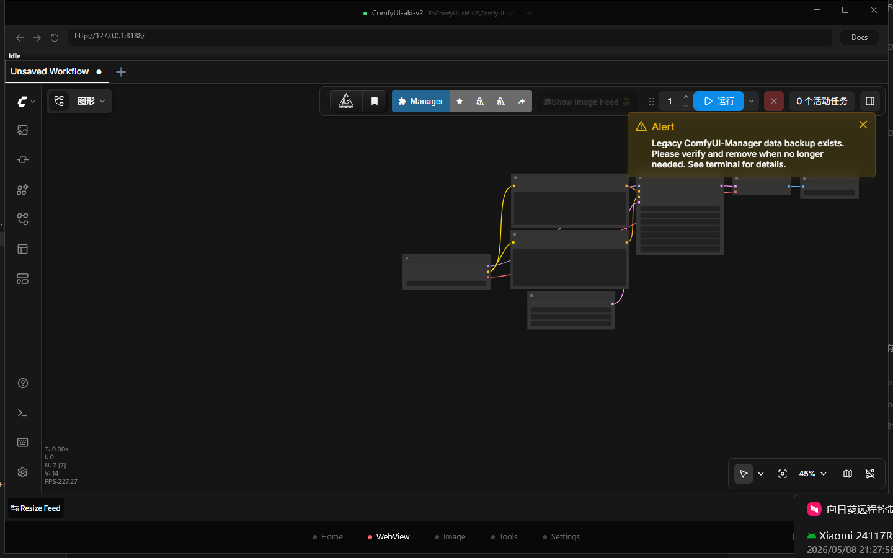

🌐 [English](README.md) | **简体中文**

# ModelFinder for ComfyUI（Windows 版）

### 一个用于安装、启动、修复和管理 ComfyUI 的桌面控制中心。

[**下载最新安装包**](https://github.com/hu-haibin/wonderful-launcher-comfyui/releases/latest) · [**2.0.26 更新说明**](https://github.com/hu-haibin/wonderful-launcher-comfyui/releases/tag/v2.0.26) · [**2.0 系列归档**](#20-系列发布归档) · [**反馈问题**](https://github.com/hu-haibin/wonderful-launcher-comfyui/issues)

---

## 为什么需要 ModelFinder

ComfyUI 很强，但 Windows 上的安装和维护经常很分散：Python 版本、PyTorch 构建、自定义节点、插件依赖、工作流资源、模型下载和启动日志都在不同地方。

ModelFinder 把这些事情集中到一个桌面应用里，让普通 ComfyUI 用户可以：

- 部署或导入 ComfyUI 环境
- 启动、停止和检查当前运行时
- 安装自定义节点和插件依赖
- 扫描工作流里的缺失模型或缺失节点
- 管理本地模型文件和下载任务
- 基于真实启动器证据诊断启动失败
- 让 AI 助手解释问题，并在授权后执行修复步骤

  

---

## 2.0.26 更新了什么

发布于 2026 年 6 月 9 日。[打开 2.0.26 GitHub Release](https://github.com/hu-haibin/wonderful-launcher-comfyui/releases/tag/v2.0.26)。

这次 WinUI 发版重点不是堆一个新页面，而是把用户最常碰到的修复链、图片工作区和支持排障证据收得更稳。目标很直接：减少错误分流、减少“点了没反应”的死角，并让 Photoshop 交互或依赖文件安装失败时至少能留下可查询的证据。

| 方向 | 变化 |
|------|------|
| **Agent 修复可靠性** | 修复了 WinUI 登录流程里会卡住的 stale pending sign-in，补齐了 WinUI Agent 的回调接线和更稳的工具分流，并让官方 `ComfyUI-Manager` 安装直接走专用启动器路径，不再依赖脆弱的仓库猜测。 |
| **图片工作区打磨** | 收紧了新版图片生成器的 composer 交互，统一了图片查看器在不同 shell 下的动作表现，也顺手整理了包管理与操作文案，让 WinUI 图片工作区在生成、浏览和复用时更顺手。 |
| **终于能查的诊断证据** | WinUI 现在会为 Photoshop 发送/导入，以及依赖文件拖拽安装记录专门的遥测和本地 app log。以后“打开了 Photoshop 但没送过去”或“拖了 requirements 没反应”不再是完全无证据的支持黑洞。 |
| **发版收口** | 先把未完成的工作流模板入口从 WinUI 首页隐藏，等这个模板浏览器真正可用后再公开。 |
| **发版验证** | WinUI build 通过，正式 `publish-release.ps1` WinUI 发布脚本已产出公开安装包，并且发布根目录的隔离 smoke 已成功拉起打包后的应用，app log tail 没有 `ERR` / `FTL`。 |

  
  
  

---

## 2.0 系列发布归档

GitHub Releases 页面会优先保留适合普通用户下载安装的稳定版本。较旧的 2.0.x 构建在被新的稳定版本替代后，可能会从 Releases 页面下架，尤其是那些已经被打包问题或 UX 回归替代的构建。正常安装时请始终优先使用最新 release；下面这张表主要用于解释每一版做了什么。

| 版本 | 日期 | 状态 | 摘要 |
|------|------|------|------|
| 2.0.25 | 2026 年 6 月 4 日 | 已发布的上一版 | 改善 WinUI / Avalonia 的登录兜底、图片工作区行为和启动/运行时收口，并把桌面版本推进到 2.0.26 线。 |
| 2.0.24 | 2026 年 6 月 2 日 | 已发布的上一版 | 替换 2.0.23 的 WinUI WebView 宿主路线，恢复带坐标的工作区拖入，并维持 installer-only 的公开资产形态。 |
| 2.0.0 | 2026 年 5 月 7 日 | 已从 Releases 下架 | 2.0 首个积分商业化版本，后续被启动、更新和本地化修复替代。 |
| 2.0.1 | 2026 年 5 月 8 日 | 已从 Releases 下架 | 修复 WinUI 启动误判失败、ComfyUI Desktop 路径处理和启动日志恢复。 |
| 2.0.2 | 2026 年 5 月 9 日 | 已从 Releases 下架 | 加入启动时自动更新处理，并恢复核心中文界面选择。 |
| 2.0.3 | 2026 年 5 月 9 日 | 已从 Releases 下架 | 补齐 WinUI 主要功能页本地化，并刷新 release 展示。 |
| 2.0.4 | 2026 年 5 月 10 日 | 已从 Releases 下架 | 改善图片工作区发送到 Photoshop 的主流程，并验证两个 Photoshop 导入分支。 |
| 2.0.5 | 2026 年 5 月 11 日 | 已从 Releases 下架 | 重做 WinUI 浅色主题、主题切换和图片工作区本地化控件。 |
| 2.0.6 | 2026 年 5 月 13 日 | 已从 Releases 下架 | Agent 操作改走当前选中运行时，并减少旧版本更新提示。 |
| 2.0.7 | 2026 年 5 月 13 日 | 已从 Releases 下架 | 打包回归版本：framework-dependent 安装包可能卡在 .NET Desktop Runtime 提示。 |
| 2.0.8 | 2026 年 5 月 13 日 | 仅保留 tag | 尝试修复 2.0.7 的运行时前置问题；线上没有公开 GitHub Release。 |
| 2.0.9 | 2026 年 5 月 13 日 | 已从 Releases 下架 | 修正打包回归，恢复 self-contained 公开安装包。 |
| 2.0.10 | 2026 年 5 月 14 日 | 已从 Releases 下架 | 增加 Agent/Image 转化遥测，并改善任务终端稳定性。 |
| 2.0.11 | 2026 年 5 月 16 日 | 已从 Releases 下架 | 保留早期 ComfyUI 输出，并清理任务终端、停止状态和本地化提示。 |
| 2.0.12 | 2026 年 5 月 18 日 | 已从 Releases 下架 | 改善 Agent 修复接管、修复进度、刷新超时和脱敏反馈上下文。 |
| 2.0.13 | 2026 年 5 月 19 日 | 已从 Releases 下架 | 移除未完成的工具页占位，并改善部署/导入选择和 release 缓存。 |
| 2.0.14 | 2026 年 5 月 19 日 | 已从 Releases 下架 | 修复任务终端证据、插件安装状态、部署完成流程和大参考图上传。 |
| 2.0.15 | 2026 年 5 月 21 日 | 已从 Releases 下架 | 改善缺失节点修复接管、任务隔离、延迟上下文状态和脱敏 Agent 反馈证据。 |
| 2.0.16 | 2026 年 5 月 23 日 | 已从 Releases 下架 | 改善启动恢复、运行时收敛、插件修复验证、包清理和新版 Image 页真机验证。 |
| 2.0.17 | 2026 年 5 月 25 日 | 已从 Releases 下架 | 增加可恢复的在线图片任务、云端结果镜像、Worker 轮询兜底、本地历史分页和更完整的 Image 真机验证。 |
| 2.0.18 | 2026 年 5 月 25 日 | 已从 Releases 下架 | 改善桌面登录兜底、积分套餐结账、Image 低余额套餐选择、Image 转化遥测、更新代理下载和 Photoshop 入口保护。 |
| 2.0.19 | 2026 年 5 月 27 日 | 已从 Releases 下架 | 增加带登录态的 Image 结果兜底下载、任务归属校验、历史恢复元数据和设置入口交接修复。 |
| 2.0.20 | 2026 年 5 月 28 日 | 已从 Releases 下架 | 将更新下载路由到 Wonderful Launcher 代理/CDN，增加更新源控制、更新取消能力，并改善 Image 参考图预上传。 |
| 2.0.21 | 2026 年 5 月 31 日 | 已从 Releases 下架 | 移除 Image 历史缩略图 tooltip 崩溃路径，增加回归保护，并重新验证真实在线 Image 链路。 |
| 2.0.22 | 2026 年 6 月 1 日 | 已从 Releases 下架 | 修复工作流解析出的模型下载需要落到 ComfyUI `custom_nodes` 的路径问题，并补充解析器保护和 Release 测试覆盖。 |
| 2.0.23 | 2026 年 6 月 2 日 | 已从 Releases 下架 | 通过原生 WebView 宿主恢复 Win10 的 ComfyUI 图片拖入，但 Win11 真机验证发现该路径可能破坏 ComfyUI 工作区交互，因此被 2.0.24 替代。 |

普通用户安装时，请始终下载最新 release。

---

## 核心使用场景

| 场景 | ModelFinder 提供什么 |
|------|----------------------|
| **安装或导入 ComfyUI** | 部署新环境，或接管已有 ComfyUI 文件夹，减少选错目录的概率。 |
| **启动和检查运行时** | 在首页启动/停止 ComfyUI，查看实时日志，打开内置工作区，确认运行状态。 |
| **修复自定义节点** | 检测缺失节点，必要时安装 ComfyUI-Manager，创建终端任务，重启并验证节点注册。 |
| **管理插件** | 从 Git URL 安装自定义节点，启用/禁用插件，删除插件，安装依赖。 |
| **查找缺失模型** | 拖入工作流后检测缺失模型引用，并从支持的目录中匹配候选下载项。 |
| **管理下载** | 在启动器里排队、跟踪、暂停、恢复和查看模型下载任务。 |
| **使用 AI 辅助** | 让 AI 助手诊断问题，授权修复工具，并把多步修复证据保留在同一会话里。 |

---

## 功能图集

  
  
  

  
  
  

---

## AI 助手边界

AI 助手集成在桌面应用里，但它不是一个不受限制的命令行。

它可以：

- 读取启动器收集到的日志和当前选中环境状态
- 解释启动失败、依赖错误和插件失败
- 检查缺失节点和缺失模型证据
- 在授权后调用受支持的启动器工具
- 为耗时安装创建任务终端
- 在同一会话里继续多步修复
- 在开启个性化后使用本地偏好和项目提示

它不会：

- 绕过写入或修复动作的用户授权
- 改变计费或积分规则
- 默认把本地个性化记忆作为云端同步内容
- 把完整终端日志、system prompt、工作流文件、token 或原始环境 dump 作为反馈数据发送

AI 功能需要登录账号，并按积分使用。当前计费规则以官方服务为准，不以这个 release 仓库为准。

---

## 快速开始

### 安装

1. 打开 [最新 GitHub Release](https://github.com/hu-haibin/wonderful-launcher-comfyui/releases/latest)。
2. 下载 `ModelFinderLauncher-Setup-v*.exe`。
3. 运行安装包并打开 ModelFinder。

> [!WARNING]
> 请下载 release 资产里的 **Setup 安装包**。不要下载 GitHub 自动生成的 `Source code.zip` 或 `Source code.tar.gz`，那是源码压缩包，不能直接运行。

> [!TIP]
> 正常安装包对桌面应用运行时是 self-contained，不需要你额外安装 Microsoft .NET Desktop Runtime。

### 导入已有 ComfyUI

1. 打开 ModelFinder，停留在首页。
2. 点击 **导入 ComfyUI**。
3. 选择包含 `main.py` 的目录，或包含 `ComfyUI` 子文件夹的便携包上层目录。
4. 在首页启动 ComfyUI。

这些目录不要误选：

- `models`
- `custom_nodes`
- `output`
- `python_embeded`
- 只有工作流文件的目录

---

## 当前产品边界

- **平台**：Windows 10 / 11
- **发布形态**：公开 Windows 安装包
- **云端能力**：AI 助手和部分工作流匹配能力需要登录与服务端能力
- **本地数据**：启动器配置、日志、包状态和可选个性化数据默认留在本机，除非某个功能明确向服务端发起请求
- **预发布版本**：如果有 beta 构建，会在 GitHub Releases 中单独标记

---

## 常见问题

<b>需要先安装 Python 吗？</b>

不需要。标准使用场景下，ModelFinder 会帮你管理 ComfyUI 的 Python 环境。

<b>可以接管我现有的 ComfyUI 吗？</b>

可以。使用 **导入 ComfyUI**，选择包含 `main.py` 的目录，或包含 `ComfyUI` 子文件夹的便携包上层目录即可。

<b>支持自定义节点吗？</b>

支持。你可以从 Git URL 安装自定义节点，管理依赖，启用或禁用插件，也可以使用 Agent 辅助的缺失节点修复。

<b>AI 助手会自动执行修复吗？</b>

涉及写入或修复的动作，仍然需要授权后才会执行。

<b>支持 macOS 或 Linux 吗？</b>

目前不支持。这个 release 仓库发布的是 Windows 构建。

---

## 关于这个仓库

这个仓库用于：

- 发布 Windows 安装包
- 保存当前版本和 1.5.3 稳定线的完整更新说明
- 通过上面的 2.0 系列归档保留内部发布历史
- 承担公开版本的问题反馈

ModelFinder 本身是围绕 ComfyUI 生态构建的闭源桌面产品。

ComfyUI 是独立的开源项目：

- ComfyUI: https://github.com/comfyanonymous/ComfyUI

---

**ModelFinder**：一个面向 ComfyUI 环境的 Windows 控制中心。

